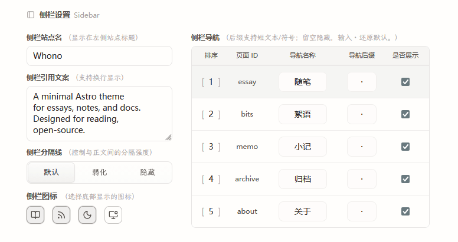
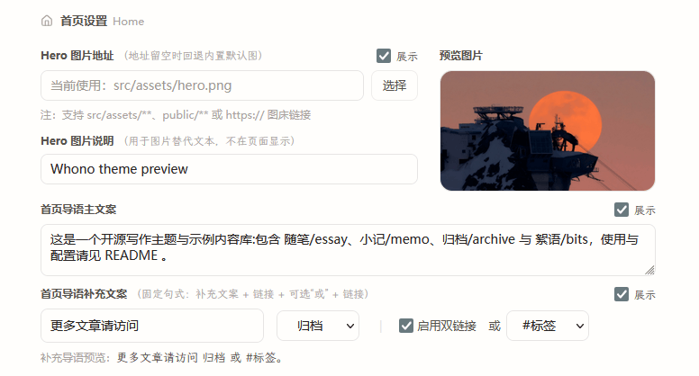

astro-whono ships a local Theme Console for managing theme-level configuration in one place during development.

The Theme Console entry point is `/admin/theme/`. It mainly covers site info, the sidebar, the home page, inner-page copy, and a few reading and code-display options, so you can quickly tune the theme settings after forking or cloning.

:::note[Development only]
`/admin/theme/` is only writable in the development environment. In production it shows a local-dev notice and offers no write access.
:::

## Local startup and entry point

Start the project locally with:

```bash
npm install
npm run dev
```

By default the dev server runs at `http://localhost:4321/`. Once it is up, open:

```text
http://localhost:4321/admin/theme/
```

If you changed the dev port, replace `4321` with your actual port.

`/admin/` is the back-office Site Overview entry, used to view a snapshot of the site. The Theme Console lives at `/admin/theme/` — note the difference between these two entry points.

## Development vs. production

The Theme Console is a configuration tool for local maintainers. Its behavior differs by environment:

- Development: `/admin/theme/` can read and save theme configuration
- Production: `/admin/theme/` only shows a local-dev notice; no writable form is displayed
- `/api/admin/settings/`: available in development only; not a public API

## Scope

The Theme Console currently handles these kinds of configuration:

- Site title, default locale, and default SEO description
- Footer year and copyright copy
- The `/admin/` Overview public toggle and its closed-state message
- Social links and their ordering
- Sidebar site name, quote copy, nav ordering, and visibility
- Sidebar action icons (reading mode / RSS / theme toggle / site overview entry)
- Home page hero, intro copy, and in-page entry links
- Main and sub titles for `/essay/`, `/archive/`, `/bits/`, `/memo/`, `/about/`
- Article meta display options
- Code block line numbers


## Configuration files

When you save, settings are written back into `src/data/settings/` by group:

```text
src/data/settings/
  site.json
  shell.json
  home.json
  page.json
  ui.json
```

> If `src/data/settings/*.json` does not exist yet, the first save in `/admin/theme/` generates them automatically.

The Theme Console manages theme configuration inside the repository, so changes can still be tracked and reverted through Git.

The read order for theme configuration is fixed: `src/data/settings/*.json` first, then legacy configuration, then project defaults. The legacy configuration mainly comes from `site.config.mjs` and default constants inside components.<br>
In other words, right after cloning you can start with the defaults; once you save anything in the Theme Console, trackable settings JSON files are generated.

## Page groups

`/admin/theme/` is currently split into five groups by editing scenario.

### Site

`Site` handles site-level basics:

- Site title
- Default locale
- Default SEO description
- Footer year and copyright copy
- Whether `/admin/` Overview is publicly shown, and the message shown when it is off
- Social links

> 

### Sidebar

`Sidebar` handles shell and navigation configuration:

- Sidebar site name
- Sidebar quote copy
- Sidebar divider style
- Sidebar action icon visibility (reading mode / RSS / theme toggle / site overview)
- Nav names, ordering, suffix characters, and visibility

> 

### Home

`Home` handles home-page display configuration:

- Hero image URL and alt text
- Hero visibility
- Home intro lead copy
- Home intro follow-up copy
- The primary and secondary links in the follow-up intro

> 

The home follow-up intro still uses a fixed sentence pattern; the console only exposes the copy and entry-link choices, to keep the home structure stable. Currently selectable entries include `archive`, `essay`, `bits`, `memo`, `about`, and `tag`.


### Inner Pages

`Inner Pages` handles unified copy and display policy for inner pages:

- `/essay/` page main and sub titles
- `/archive/` page main and sub titles
- `/bits/` page main and sub titles
- `/memo/` page main and sub titles
- `/about/` page main and sub titles
- Whether article meta shows date, tags, word count, and reading time
- `/bits/` default author name and avatar

> 


### Code

- Whether to show line numbers in code blocks


## Save mechanism

- Saves are written back by group (`site / shell / home / page / ui`); template source code is not edited directly
- Most fields offer live preview or a clear page mapping
- Field validation runs before saving
- A revision tag is attached on save to avoid silent overwrites from concurrent edits
- The write process includes failure rollback, preventing a half-success state across multiple files

---

That covers the common configuration entry points and save mechanism for the Theme Console today. If you run into configuration issues or save problems, feel free to open an Issue.
